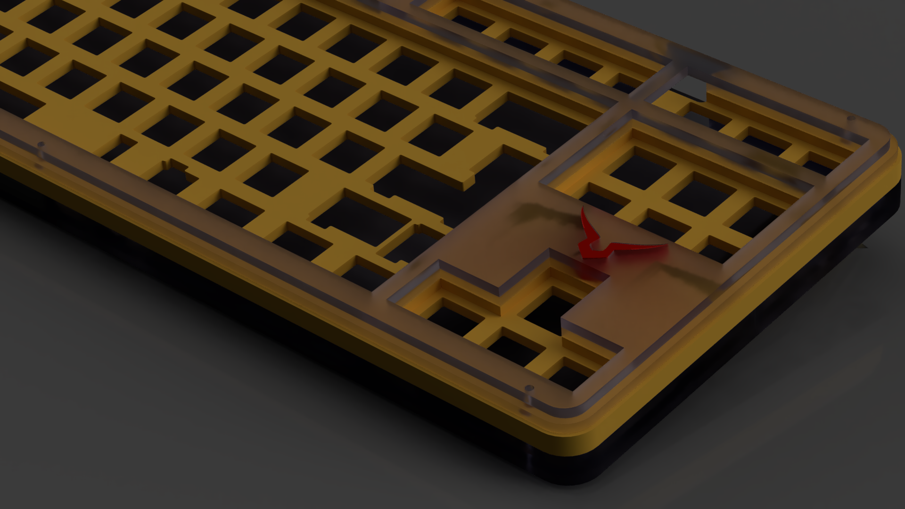
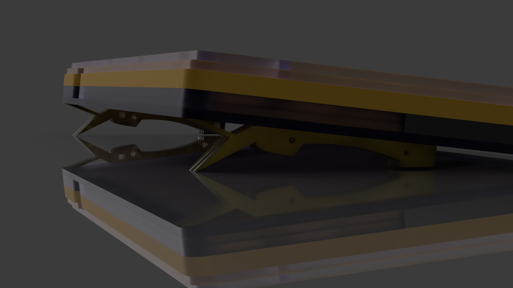
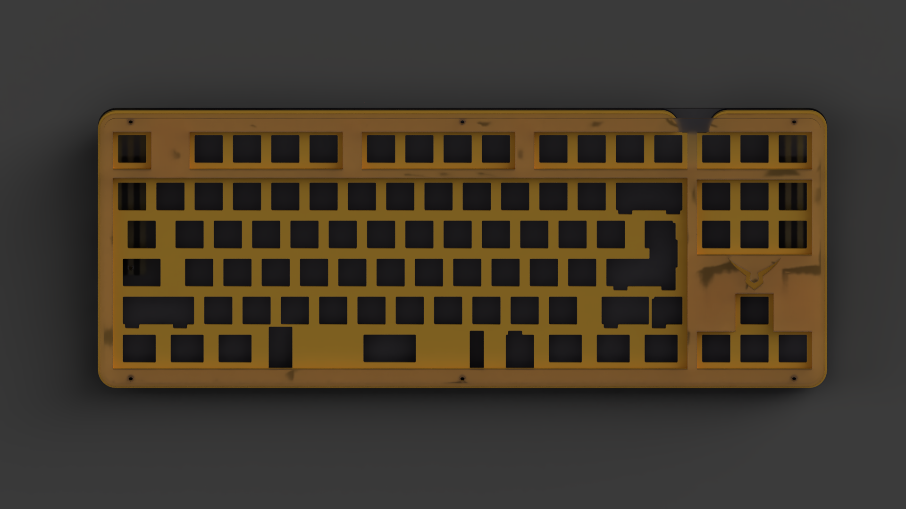

# kinda ready 
# whats this ?
a stacked 3mm acrylic case, 
uses m2 screws and standoffs,
for Hineybush H87a , H87c , KBD8X MKII PCB and some other tkl pcbs  
# Renders

# license 
licensed under the [gpl-3.0](LICENSE)
# disclaimer
USE THIS FILES AT YOUR OWN RISK
