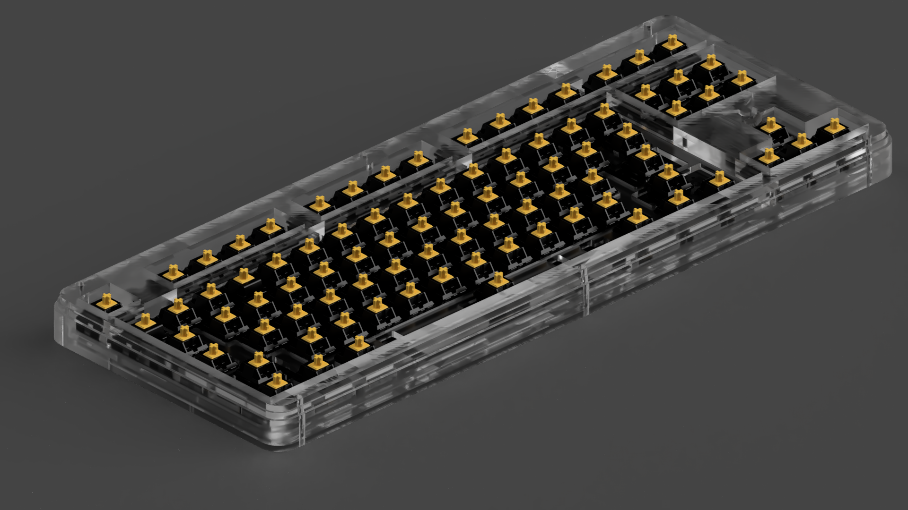
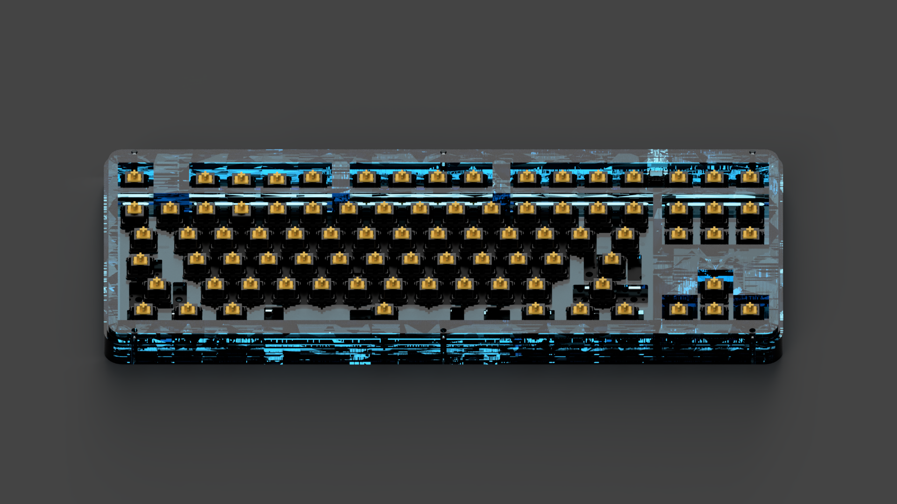
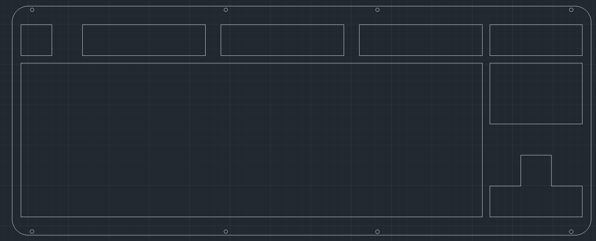
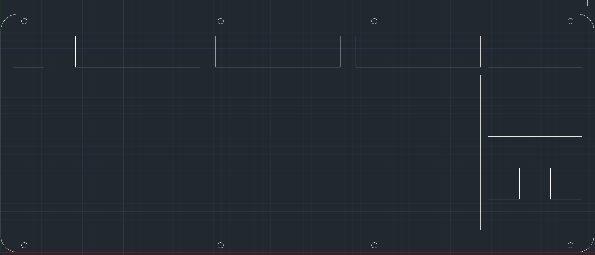
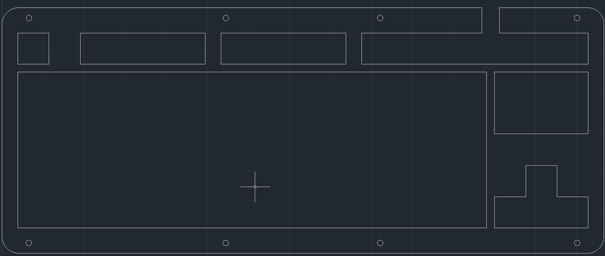
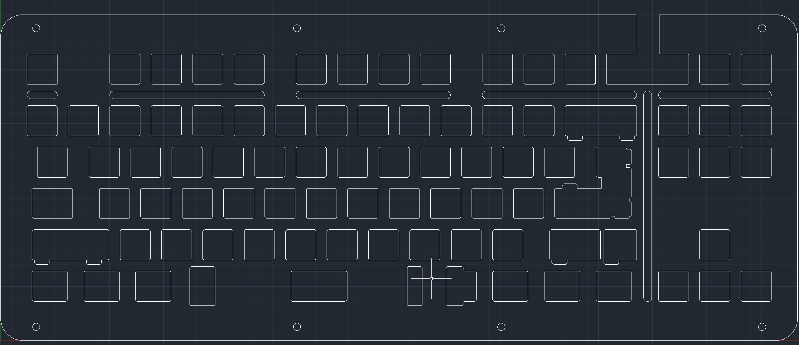
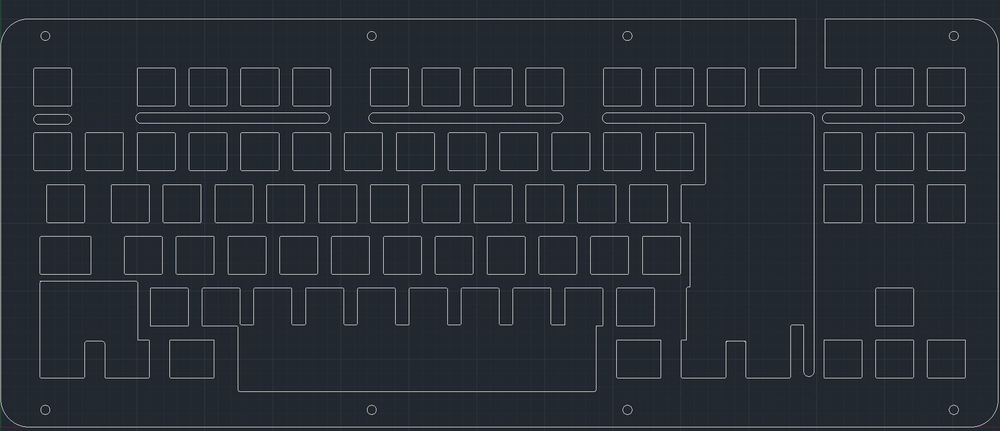
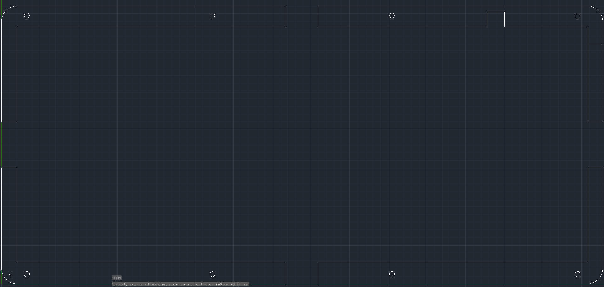
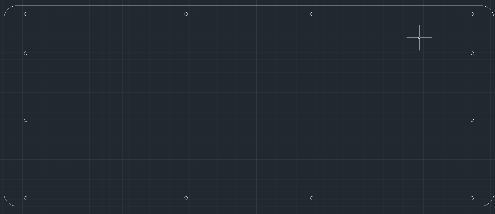

# whats this ?
a stacked 3mm acrylic case, 
uses m2 screws and standoffs,
for  H87a , H87c , KBD8X MKII PCBs and some other tkl pcbs  
# Renders
need to update this :)

# license 
licensed under the [gpl-3.0](LICENSE)
# disclaimer
USE THIS FILES AT YOUR OWN RISK
# layer order
| order | preview |
| --- | --- |
| top1 3 mm| |
| top2 3mm | |
| top3 3mm | |
| plate 1.5 mm| |
| support 3mm| |
| spacers x2 3mm| |
| bottom 3mm| |
